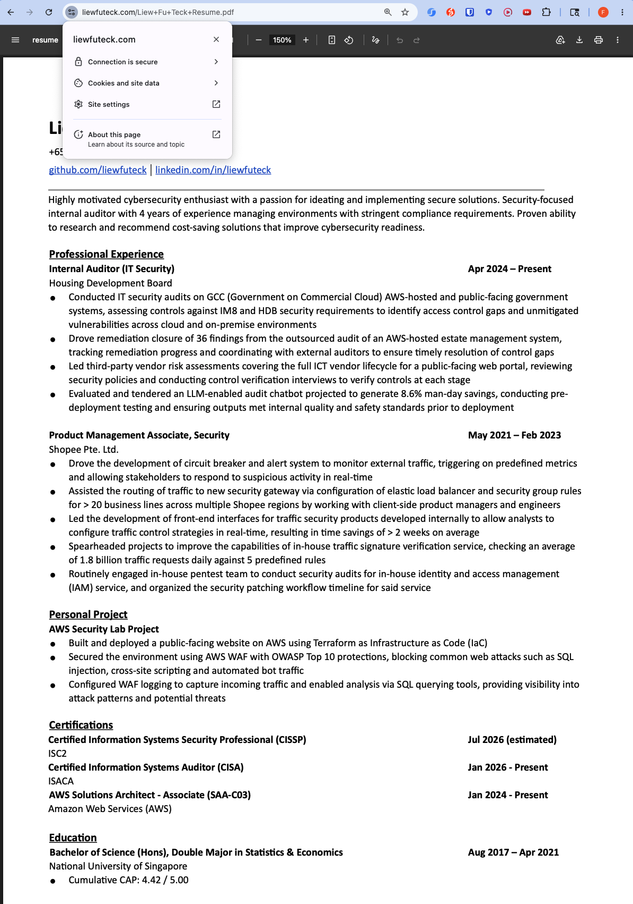
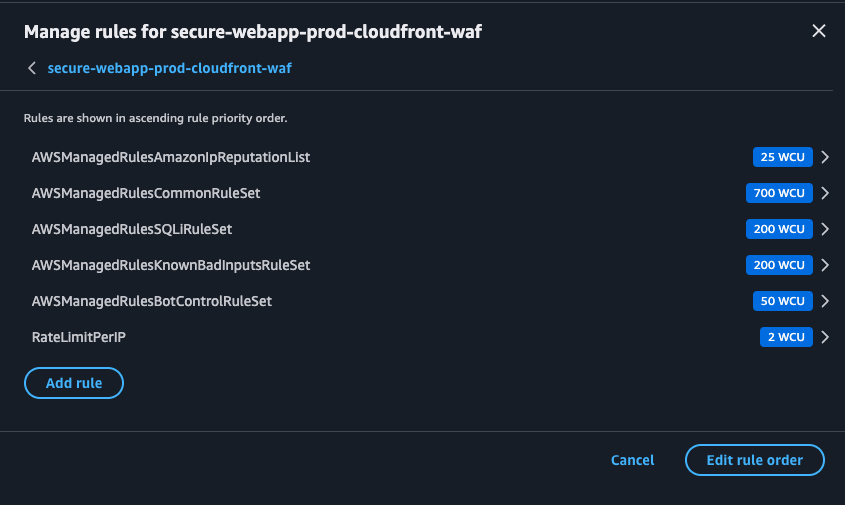
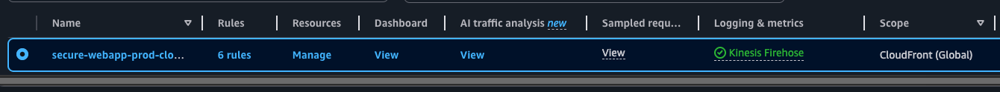

# AWS Secure Web App – Terraform

> **Cloud-hosted web environment on AWS with WAF configured for OWASP Top 10 detection/blocking, including SQLi, XSS, and automated bot traffic.**

---

## Architecture

Below is the Terraform resource graph for this infrastructure:

```
Internet
   │
   ▼
AWS WAF (CloudFront scope)        ← OWASP rules, rate-limit, bot control
   │
   ▼
CloudFront (CDN + TLS termination)
   ├── /* (static) ──────────────► S3 (static assets, via OAC)
   │
   └── (future backend) ─────────► AWS WAF (Regional scope)
                                          │
                                         ALB
```

The following is the static site currently served through this infrastructure:



### Components

| Resource | Purpose |
|---|---|
| **VPC** | Isolated network with public subnets (ALB) and private subnets (future backends); single NAT Gateway for egress |
| **S3** | Private bucket for static HTML/CSS/JS; served via CloudFront OAC (no public access) |
| **CloudFront** | CDN, TLS 1.2+, HTTP→HTTPS redirect; serves static content from S3 |
| **ALB** | Application Load Balancer provisioned for future backend use; protected by the `X-Origin-Verify` header to prevent direct access bypassing CloudFront |
| **WAF (CloudFront)** | Protects the CDN edge — blocks threats before traffic reaches any origin |
| **WAF (Regional/ALB)** | Second WAF layer at the ALB; defence-in-depth for any traffic that reaches the load balancer |
| **CloudTrail** | Multi-region audit trail; management + S3 data events; logs to S3 + CloudWatch Logs |
| **KMS** | Customer-managed encryption key for all log buckets |

---

## WAF Rules

| Priority | Rule | Threat |
|---|---|---|
| 10 | `AWSManagedRulesAmazonIpReputationList` | Known malicious IPs, botnets |
| 20 | `AWSManagedRulesCommonRuleSet` | OWASP Top 10: XSS, path traversal, bad headers |
| 30 | `AWSManagedRulesSQLiRuleSet` | SQL injection |
| 40 | `AWSManagedRulesKnownBadInputsRuleSet` | Log4Shell, SSRF, malformed input |
| 50 | `AWSManagedRulesBotControlRuleSet` | Automated scrapers, credential stuffing |
| 60 | `RateLimitPerIP` *(custom)* | 2000 req / 5 min per source IP → HTTP 429 |



### WAF Logging

WAF logs are delivered to S3 through Amazon Kinesis Firehose, where they can be queried with Amazon Athena for threat analysis and audit purposes.




---

## Viewing Logs

```sql
-- Sample SQL statement
SELECT timestamp, action, httprequest.clientip, httprequest.uri
FROM waf_logs
WHERE action = 'BLOCK'
ORDER BY timestamp DESC
LIMIT 100;
```

CloudTrail logs are also stored in an S3 bucket, and can either be analysed using Athena or streamed to a CloudWatch log group for real-time alerting.

---

## Domain & SSL Configuration

The application was initially accessible only via the default CloudFront domain. To expose it on a custom domain with HTTPS, three services were configured:

- **AWS Certificate Manager** — Issued a public SSL certificate for `liewfuteck.com`, validated via DNS validation
- **Amazon Route 53** — Created a hosted zone for `liewfuteck.com` with an A Alias record pointing to the CloudFront distribution

  

- **SiteGround** — Replaced default nameservers with Route 53 nameservers, delegating DNS authority to AWS

  

After adding the A record and CNAME record to Route 53, both `www.liewfuteck.com` and `liewfuteck.com` resolve securely to the CloudFront distribution with TLS terminating at the edge.

---

## Security Hardening Checklist

### Completed

- [x] AWS access keys and secrets excluded from Git via `.gitignore` (`.env`, `*.tfvars`, `*.tfstate` are all protected)

### To-dos

- [ ] Store `origin_verify_secret` in AWS Secrets Manager and reference it via a Terraform data source instead of `terraform.tfvars`
- [ ] Set `enable_deletion_protection = true` on the ALB in production (currently set to `false` for testing purposes)
- [ ] Narrow CloudTrail `data_resource` from all S3 (`arn:aws:s3:::`) to the specific static assets bucket ARN
- [ ] Add ALB access logs to an S3 bucket for full request visibility
- [ ] Enable CloudFront access logging
- [ ] Set up SNS notifications on the CloudWatch WAF blocked-requests alarm
- [ ] Consider AWS Shield Advanced for DDoS protection on critical workloads
